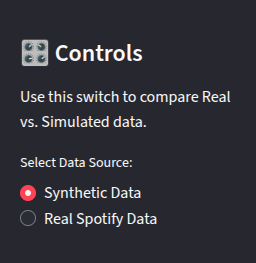

# 🎧 Spotify Lakehouse: Hybrid Data Engine

## Project Overview
A **Serverless Data Lakehouse** that extracts personal streaming history from the Spotify API, transforms it using **PySpark**, and visualizes behavioral patterns in a **Streamlit** dashboard.

**Key Innovation:** This pipeline implements a **Hybrid Data Architecture**. It ingests both **Real-Time Telemetry** (from Spotify) and **Synthetic Data** (generated via Faker) simultaneously. The Dashboard features a **Source Toggle**, allowing users to instantly switch between analyzing real user behavior and simulated high-volume scenarios.

## Architecture
1.  **Hybrid Ingestion (Bronze):** Python script captures live data via Spotify OAuth 2.0. If live data is sparse, it triggers a fallback generator to create synthetic user events.
2.  **Tagging & Processing (Silver):** **PySpark** jobs ingest mixed JSON streams, tagging each row with `data_source` metadata before flattening nested schemas into a partitioned Parquet Lake.
3.  **Interactive Analytics (Gold):** **Streamlit** app reads the Parquet layer and provides a "Source Switch" to filter metrics dynamically.

## Tech Stack
* **Processing:** Apache Spark (PySpark)
* **Ingestion:** Spotify Web API & Python Faker
* **Visualization:** Streamlit, Plotly Express
* **Infrastructure:** Google Colab, Ngrok Tunneling

## How to Run
1.  Clone the repo.
2.  Open `notebooks/spotify_etl_pipeline.ipynb` in Google Colab.
3.  Add your Spotify Credentials (`SPOTIFY_CLIENT_ID`, `SPOTIFY_CLIENT_SECRET`) to Colab Secrets.
4.  Run the pipeline to ingest Real + Synthetic data.
5.  Launch the dashboard and use the **Sidebar Toggle** to compare datasets.
